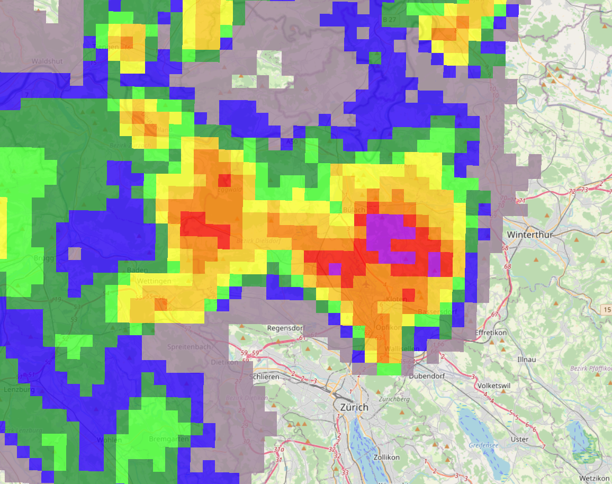
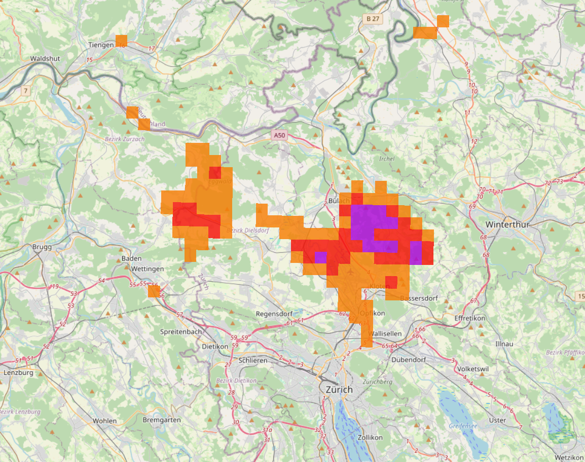

# Radar Visualisation for HDF5/NetCDF files

When MeteoSwiss announced that they will make weather [data publicly available](https://github.com/MeteoSwiss/opendata-radar-data), I wondered what could be done with this data. I wanted it to be visible in the Leaflet app we use at work. But I couldn't find (for me) understandable resources how to visualize radar data, so I contacted their OGD team.

They helped me with insights, cleared my mental model of the data and gave me the tip to just use QGIS 🤯. Never thought about this before, I'm always impressed how powerful this handy tool is.

I still prepare the [default rendering styles](/styles) in QGIS, as it is freely available and a good visual way to check what you are going to create. GDAL (the library used for rendering) can use many different color palettes, but \*.qml files from QGIS have been the most easy one for me.

## 🚀 TLDR;

1. Make sure git and Docker is installed. We will use [GDAL Docker images](https://github.com/OSGeo/gdal/tree/master/docker).
1. Pull this repo `git clone https://github.com/martinschilliger/Radar-Visualisation.git` and move into it `cd Radar-Visualisation`
1. Pull the GDAL container: `docker pull ghcr.io/osgeo/gdal:alpine-normal-latest`
1. Supply a NetCDF file like the [MeteoSwiss example file](examples/CPC2335513304_00060.001.h5) (I have found it here https://github.com/MeteoSwiss/publication-opendata?tab=readme-ov-file#2623-combiprecip-data). Naming is up to you.
1. Edit the script to your needs and make it executable: `chmod +x render.sh`
1. Run the script 🎉. `./render.sh examples/CPC2335513304_00060.001.h5`

## 🔍 Detailed explanation

HDF5/NetCDF is a file standard used all across Europe to exchange data, like rain measurement of radar stations. It has like a coordinate raster with data in it how much rain there was with a defined scale also in this file.

First we will install the basics and print the information of your file.

### Preparing

1. Make sure git and Docker is installed. Tested only in my mac, but should also work on Windows (in a bash console) and naturally in Linux. If you use Windows and plan to regulary work with containers and scripts, maybe you want to [install WSL from Microsoft](https://learn.microsoft.com/en-us/windows/wsl/install). As the rendering of XYZ tiles creates many files, solo windows will be really slow to work with.
1. Open a terminal window where you want to work with that data. Should be local as there will be many files written. Pull this repo `git clone https://github.com/martinschilliger/Radar-Visualisation.git`. It will create a folder, move into it `cd Radar-Visualisation`.
1. We will use [GDAL Docker images](https://github.com/OSGeo/gdal/tree/master/docker). Pull the right one for you, I used alpine normal `docker pull ghcr.io/osgeo/gdal:alpine-normal-latest`

### Print the file information

Now we are ready. If you want print some information about the file we will use (the expamle one here): `docker run --rm -v .:/home ghcr.io/osgeo/gdal:alpine-normal-latest gdalinfo -stats /home/examples/CPC2335513304_00060.001.h5`

<details>

<summary>The result should look like this:</summary>

```
Warning!  Library version information error.
The HDF5 library version information are not consistent in its source code.
This is NOT a fatal error but should be corrected.  Setting the environment
variable 'HDF5_DISABLE_VERSION_CHECK' to a value of 1 will suppress
this warning.
Library version information are:
H5_VERS_MAJOR=1, H5_VERS_MINOR=14, H5_VERS_RELEASE=4, H5_VERS_SUBRELEASE=2,
H5_VERS_INFO=HDF5 library version: 1.14.4
Driver: HDF5Image/HDF5 Dataset
Files: /home/examples/CPC2335513304_00060.001.h5
Size is 710, 640
Coordinate System is:
BOUNDCRS[
    SOURCECRS[
        PROJCRS["unknown",
            BASEGEOGCRS["unknown",
                DATUM["Unknown based on Bessel 1841 ellipsoid using towgs84=674.374,15.056,405.346,0,0,0,0",
                    ELLIPSOID["Bessel 1841",6377397.155,299.1528128,
                        LENGTHUNIT["metre",1,
                            ID["EPSG",9001]]]],
                PRIMEM["Greenwich",0,
                    ANGLEUNIT["degree",0.0174532925199433],
                    ID["EPSG",8901]]],
            CONVERSION["unknown",
                METHOD["Hotine Oblique Mercator (variant B)",
                    ID["EPSG",9815]],
                PARAMETER["Latitude of projection centre",46.9524055555556,
                    ANGLEUNIT["degree",0.0174532925199433],
                    ID["EPSG",8811]],
                PARAMETER["Longitude of projection centre",7.43958333333333,
                    ANGLEUNIT["degree",0.0174532925199433],
                    ID["EPSG",8812]],
                PARAMETER["Azimuth at projection centre",90,
                    ANGLEUNIT["degree",0.0174532925199433],
                    ID["EPSG",8813]],
                PARAMETER["Angle from Rectified to Skew Grid",90,
                    ANGLEUNIT["degree",0.0174532925199433],
                    ID["EPSG",8814]],
                PARAMETER["Scale factor at projection centre",1,
                    SCALEUNIT["unity",1],
                    ID["EPSG",8815]],
                PARAMETER["Easting at projection centre",2600000,
                    LENGTHUNIT["metre",1],
                    ID["EPSG",8816]],
                PARAMETER["Northing at projection centre",1200000,
                    LENGTHUNIT["metre",1],
                    ID["EPSG",8817]]],
            CS[Cartesian,2],
                AXIS["(E)",east,
                    ORDER[1],
                    LENGTHUNIT["metre",1,
                        ID["EPSG",9001]]],
                AXIS["(N)",north,
                    ORDER[2],
                    LENGTHUNIT["metre",1,
                        ID["EPSG",9001]]]]],
    TARGETCRS[
        GEOGCRS["WGS 84",
            DATUM["World Geodetic System 1984",
                ELLIPSOID["WGS 84",6378137,298.257223563,
                    LENGTHUNIT["metre",1]]],
            PRIMEM["Greenwich",0,
                ANGLEUNIT["degree",0.0174532925199433]],
            CS[ellipsoidal,2],
                AXIS["latitude",north,
                    ORDER[1],
                    ANGLEUNIT["degree",0.0174532925199433]],
                AXIS["longitude",east,
                    ORDER[2],
                    ANGLEUNIT["degree",0.0174532925199433]],
            ID["EPSG",4326]]],
    ABRIDGEDTRANSFORMATION["Transformation from unknown to WGS84",
        METHOD["Position Vector transformation (geog2D domain)",
            ID["EPSG",9606]],
        PARAMETER["X-axis translation",674.374,
            ID["EPSG",8605]],
        PARAMETER["Y-axis translation",15.056,
            ID["EPSG",8606]],
        PARAMETER["Z-axis translation",405.346,
            ID["EPSG",8607]],
        PARAMETER["X-axis rotation",0,
            ID["EPSG",8608]],
        PARAMETER["Y-axis rotation",0,
            ID["EPSG",8609]],
        PARAMETER["Z-axis rotation",0,
            ID["EPSG",8610]],
        PARAMETER["Scale difference",1,
            ID["EPSG",8611]]]]
Data axis to CRS axis mapping: 1,2
Origin = (2255024.271337525919080,1480242.287008441751823)
Pixel Size = (1000.053878008132187,-1000.194373984924141)
Metadata:
  Conventions=ODIM_H5/V2_3
  dataset1_data1_what_gain=1
  dataset1_data1_what_nodata=nan
  dataset1_data1_what_offset=0
  dataset1_data1_what_quantity=ACRR
  dataset1_data1_what_undetect=inf
  dataset1_what_enddate=20231221
  dataset1_what_endtime=133000
  dataset1_what_prodname=CHCPC_00060
  dataset1_what_product=RR
  dataset1_what_startdate=20231221
  dataset1_what_starttime=123000
  how_MeteoSwiss_Diff=0.692809795557889
  how_MeteoSwiss_Excluded.raingauges=DOL,GSB,SAE
  how_MeteoSwiss_grid_mapping_name=swiss_coordinates
  how_MeteoSwiss_grid_name=combiprecip
  how_MeteoSwiss_long_name=00060-min precipitation raingauge-adjusted
  how_MeteoSwiss_Nr.raingauges.used=99
  how_MeteoSwiss_PID=CPC233551330
  how_MeteoSwiss_prod_date=2023-12-21 13:38:42 GMT
  how_MeteoSwiss_Qc=4
  how_MeteoSwiss_Qr=9
  how_MeteoSwiss_Qw=14
  how_MeteoSwiss_reprocessed=0
  how_MeteoSwiss_time=UNLIMITED
  how_MeteoSwiss_time.stamp=2023-12-21 13:30:00 GMT
  how_MeteoSwiss_VERSION="COMBIPRECIP-V3.9.2_2023-05-24_zuerh250.meteoswiss.ch"
  how_nodes=WMOID:06661,WMOID:06699,WMOID:06768,WMOID:06726,WMOID:06776
  what_date=20231221
  what_object=COMP
  what_source=ORG:215, CTY:644, CMT:MeteoSwiss (Switzerland)
  what_time=133000
  what_version=H5rad 2.3
  where_LL_lat=43.6301
  where_LL_lon=3.169
  where_LR_lat=43.6201
  where_LR_lon=11.9566
  where_projdef=+proj=somerc +lat_0=46.95240555555556 +lon_0=7.439583333333333 +k_0=1 +x_0=2600000 +y_0=1200000 +ellps=bessel +towgs84=674.374,15.056,405.346,0,0,0,0 +units=m +no_defs
  where_UL_lat=49.3767
  where_UL_lon=2.6896
  where_UR_lat=49.3654
  where_UR_lon=12.4634
  where_xscale=1
  where_xsize=710
  where_yscale=1
  where_ysize=640
Image Structure Metadata:
  COMPRESSION=DEFLATE
Corner Coordinates:
Upper Left  ( 2255024.271, 1480242.287) (  2d41'23.21"E, 49d22'41.51"N)
Lower Left  ( 2255024.271,  840117.888) (  3d10' 9.39"E, 43d37'51.77"N)
Upper Right ( 2965062.525, 1480242.287) ( 12d27'54.73"E, 49d22' 1.02"N)
Lower Right ( 2965062.525,  840117.888) ( 11d57'28.86"E, 43d37'15.33"N)
Center      ( 2610043.398, 1160180.087) (  7d34'14.38"E, 46d35'38.73"N)
Band 1 Block=710x640 Type=Float64, ColorInterp=Undefined
  Minimum=0.000, Maximum=2.400, Mean=0.026, StdDev=0.097
  Metadata:
    CLASS=IMAGE
    IMAGE_VERSION=1.2
    rhdf5-NA.OK=1
    STATISTICS_MAXIMUM=2.4
    STATISTICS_MEAN=0.026329591124037
    STATISTICS_MINIMUM=0
    STATISTICS_STDDEV=0.097444847156438
    STATISTICS_VALID_PERCENT=76.88
```

</details>

<details>

<summary>Explanation of this command</summary>

- `docker run --rm` This will run the container and remove it afterwards directly again. `ghcr.io/osgeo/gdal:alpine-normal-latest` is the container used
- `-v .:/home` binds you curent folder (`.`) into the container (as `/home`)
- `gdalinfo -stats` runs the program (see https://gdal.org/en/latest/programs/index.html#general for all available).
- `/home/examples/CPC2335513304_00060.001.h5` our supplied file with the path inside the container.
</details>

### Make the first rendering

Now here starts the show. Finally.

1. Edit the `render.sh` script with a text editor to your needs, if you want. Defaults should work for first run.
1. Make the script executable `chmod +x ./render.sh`
1. Run the script with the file `./render.sh examples/CPC2335513304_00060.001.h5`
1. Open one of the created files in you favorite browser, for example `openlayers.html`
1. Enjoy the data and start playing with settings (`render.sh`) and styles `/styles`. The easiest way for editing styles is QGIS (see below).

## 🎨 Styles

I created some basic styles to start with. I just grapped the colors from the legend of the [MeteoSwiss precipitation site](https://www.meteoswiss.admin.ch/services-and-publications/applications/precipitation.html). If your visualization works, you will get results like below.

_Hint: The data used here is not the example file._

### styles/MeteoSwiss-Website.qml

Looks like the precipitation website of MeteoSwiss.



### styles/MeteoSwiss-Website-Intense.qml

Same data, but the idea here was to only have radar data visible in the map, if there is a chance of damages (like flooded cellars).



## 🗺 QGIS

For visualizing only one data file, the most easy way is to just use QGIS. As it can be overwhelming on first start, here's a quick how to:

1. Open a new project
2. Drag'n'drop the _.h5 or _.nc file into the window. It will be added as a layer. And also visualized, but as it doesn't contain color only grayscale.
3. Double click the layer and move to the symbolization panel. At the bottom of the window you can import styles, use one here in the repo. After importing the style you could change it if you want or just close the panel, you will see the data visualized on a white background.
4. Export the data only or add some background layer to make it easily visible. Head over to the Browser panel, there you find «OpenStreetMap» under «XYZ Tiles». Use it with drag'n'drop, just make sure it is below your data layer.
